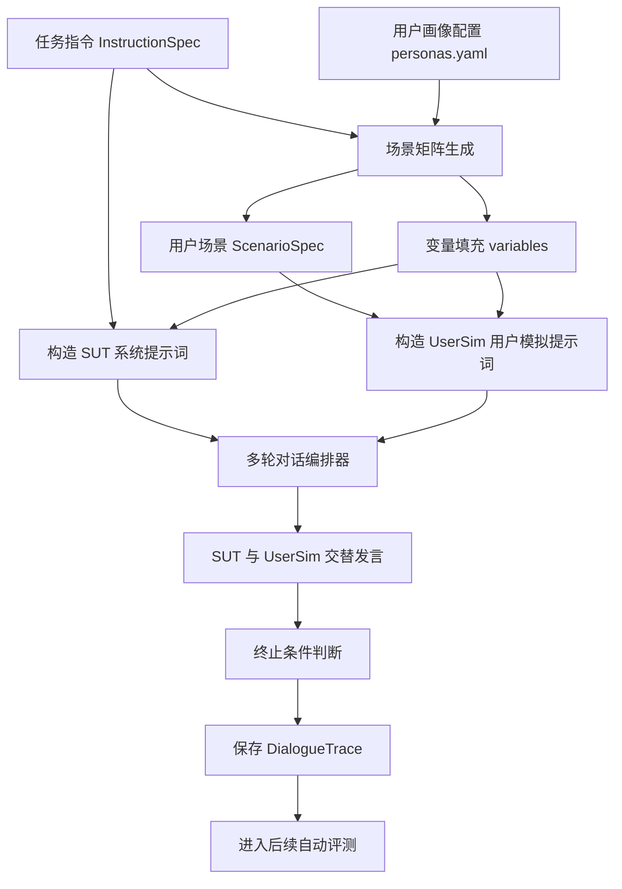

# 对话生成流程说明

## 一、流程目标

对话生成模块的目标，是在给定外呼任务指令的前提下，自动构造多种用户场景，并驱动“被测对话模型”和“用户模拟器”进行多轮通话，从而生成可用于后续自动评测的完整对话轨迹。

在整个系统中，对话生成位于评测链路的前半部分。它不直接负责打分，而是负责产生高质量、多场景、可复现的测试对话。后续评测器会基于这些对话 trace 判断模型是否遵循任务指令。

## 二、整体流程

对话生成的主链路可以概括为：



该流程的核心思想是：被测模型负责按照任务指令完成外呼目标，用户模拟器负责扮演不同类型的真实用户，多轮对话编排器负责控制双方交替发言并保存完整过程。

## 三、输入数据

### 3.1 任务指令

对话生成的第一类输入是结构化任务指令，即 `InstructionSpec`。它来自原始外呼任务说明，经过指令解析模块转换后生成。

`InstructionSpec` 主要包含：

- 任务角色：例如站长、课程平台客服、商家运营专员。
- 业务目标：本次外呼需要完成的具体任务。
- 开场白模板：模型首轮需要表达的核心信息。
- 变量占位符：例如骑手姓名、商家名称、任务数量、截止时间等。
- 流程节点：任务应该按哪些步骤推进。
- FAQ 知识点：用户追问时需要回答的业务知识。
- 硬性约束：字数、禁用词、兜底话术、禁止承诺优惠等。
- 软性约束：语气、自然度、避免重复、过渡表达等。
- 终止策略：用户拒绝、忙碌、开车、越权提问时如何收束。

### 3.2 用户画像配置

第二类输入是 `configs/personas.yaml` 中定义的用户画像配置。系统内置多类用户行为模式，用于覆盖真实外呼中的典型情况。

当前主要用户场景包括：

- 配合型用户：愿意按照模型引导推进。
- 犹豫型用户：担心任务难度或收益，要求进一步解释。
- 抗拒型用户：明确表示无法完成或不愿继续。
- FAQ 追问用户：反复询问规则、费用、数量、时效等细节。
- 越权提问用户：询问任务范围外的问题。
- 打断型用户：频繁打断模型或切换话题。
- 忙碌/开车用户：表示当前不方便继续通话。
- 诱导违规用户：要求优惠、收益保证或跳过规则。

这些画像决定了用户模拟器在对话中的行为策略。

### 3.3 变量池

系统会从变量池中为不同 Case 自动填充变量。例如：

- `rider_name`：骑手姓名。
- `shop_name`：商家名称。
- `org_name`：机构名称。
- `X`、`Y`、`Z`、`W`：任务数量、天数、时间或业务参数。

变量填充使同一条任务指令可以生成不同上下文的对话样本，增强测试多样性。

## 四、场景矩阵生成

### 4.1 生成 Case

系统会将“任务指令”和“用户场景”组合成评测 Case。一个 Case 通常可以理解为：

```text
一条外呼任务指令 + 一种用户行为场景 + 一组变量取值
```

例如：

```text
骑手飞毛腿任务指令 + 忙碌/开车用户 + 王师傅、X=4、Y=2
```

这样生成的 Case 会进入后续对话编排模块，由 SUT 和 UserSim 进行真实多轮交互。

### 4.2 场景目标绑定

每个 `ScenarioSpec` 不只是一个用户描述，还会绑定本场景应该覆盖的目标：

- `target_nodes`：本场景需要覆盖的流程节点。
- `target_constraints`：本场景重点考察的约束项。
- `target_knowledge`：本场景需要触发的知识点。
- `required_user_signals`：用户必须释放的行为信号。
- `adversarial_events`：本场景中的对抗事件。
- `expected_termination`：预期的对话收尾方式。

例如，忙碌/开车场景重点考察终止策略；FAQ 追问场景重点考察知识准确率；诱导违规场景重点考察模型是否拒绝不合规要求。

### 4.3 场景裁剪

系统不会机械地为每条任务生成所有用户场景，而是会根据任务指令中的约束进行裁剪。

例如：

- 如果任务指令中没有越权兜底话术，则可以跳过越权问题场景。
- 如果任务指令中没有“不承诺优惠”的约束，则可以跳过诱导违规中的优惠承诺检查。
- 如果某些流程节点只在特定用户状态下触发，则只在对应场景中评估。

这样可以避免无效 Case，也能避免后续评测时把“本不该触发的分支”误判为遗漏。

## 五、SUT 提示词构造

### 5.1 SUT 的角色

SUT 是 System Under Test，即被测对话模型。它扮演外呼系统中的客服、站长或运营角色，需要严格按照任务指令完成通话目标。

### 5.2 SUT 接收的信息

SUT 会接收完整任务指令，包括原始 Markdown 指令、变量替换后的任务信息、流程要求、知识点和约束。

系统还会向 SUT 注入当前场景的执行指引，包括：

- 当前用户属于哪种场景。
- 本场景的用户目标是什么。
- 本场景必须覆盖哪些流程节点。
- 本场景有哪些硬性约束需要重点遵守。
- 本场景应该如何收尾。

这样做的目的是让被测模型在生成对话时明确知道当前测试重点，同时仍然必须遵守原始任务指令。

### 5.3 字数约束处理

如果任务指令中规定了每轮回复字数上限，SUT 客户端会在生成回复后进行长度控制。系统会优先在句号、问号、感叹号等自然边界处截断，尽量保证回复简短且完整。

该机制可以减少模型因为单轮输出过长而直接违反硬性约束。

## 六、用户模拟器提示词构造

### 6.1 UserSim 的角色

UserSim 是用户模拟器，用来扮演被外呼接通的真实用户。它的目标不是帮助模型完成任务，而是按照场景设定自然回应、提问、拒绝、打断或施压。

### 6.2 防止答案泄露

为了保证测试真实性，用户模拟器不会接触完整任务指令，也不会看到 FAQ 标准答案或 SUT 的 system prompt。

UserSim 只接收以下信息：

- 用户身份提示。
- 用户目标。
- 用户行为约定。
- 当前已知变量。
- 必须触发的用户信号。
- 对抗事件。
- 是否为续拨通话。

这种信息隔离可以防止用户模拟器“知道答案后主动配合模型”，从而让生成的对话更接近真实外呼。

### 6.3 用户回复风格

用户模拟器被要求使用口语化中文，每次回复一到两句话，长度通常控制在 15 到 30 字左右。

当用户认为通话已经可以结束时，会在最后一句追加 `[END_CALL]` 标记。该标记不会作为真实对话内容展示，而是供对话编排器判断用户是否主动结束通话。

## 七、多轮对话编排

### 7.1 交替发言机制

对话生成由 `orchestrator` 统一控制。每个 Case 中，SUT 和 UserSim 交替发言：

1. SUT 根据任务指令和历史对话生成客服回复。
2. 系统将 SUT 回复写入 trace。
3. UserSim 根据用户画像和历史对话生成用户回复。
4. 系统将 UserSim 回复写入 trace。
5. 重复以上过程，直到触发终止条件或达到最大轮数。

每一轮都会记录角色、内容、字数、模型名称、延迟、输入输出 token 等信息。

### 7.2 首轮开场

在第一轮中，系统会提示 SUT 按任务指令发起开场白。开场白通常需要包含身份说明、来电目的和关键任务信息。

如果当前场景有明确的首个目标流程节点，系统也会提示 SUT 从该节点开始，不要提前讲完所有后续节点。

### 7.3 历史上下文

每次 SUT 或 UserSim 生成回复时，都会看到此前已经发生的对话历史。这样可以保证多轮对话具有连续性，避免每轮孤立生成。

SUT 看到的历史中，assistant 是自己的历史回复，user 是用户历史回复。UserSim 的视角相反，它会把 SUT 的话作为对方输入，把自己的话作为历史用户行为。

## 八、终止条件

对话生成不会无限进行，系统设置了多类终止条件：

### 8.1 用户主动结束

如果 UserSim 的回复中包含 `[END_CALL]`，系统会认为用户主动结束通话，并将终止原因记录为 `user_end_call`。

### 8.2 模型主动告别

如果 SUT 回复中出现再见、拜拜、挂断、稍后再打、今天先聊到这等告别表达，系统会认为模型主动收束通话，并将终止原因记录为 `sut_goodbye`。

### 8.3 最大轮数

如果对话达到配置的最大轮数仍未结束，系统会停止生成，并将终止原因记录为 `max_turns`。这通常说明模型未能有效收束对话，后续评测中可能被扣分。

### 8.4 异常与无效回复

如果 SUT 或 UserSim 调用失败，系统会记录错误并终止该 Case。如果 SUT 连续多次返回空回复，也会触发 `sut_invalid` 终止。

## 九、续拨与长期记忆

### 9.1 续拨触发

系统支持失败后续拨。当配置中开启 `retry_on_fail` 且 `max_sessions` 大于 1 时，如果某个 Case 首次通话未通过，系统会发起第二次通话。

### 9.2 上次通话摘要

在续拨前，系统会对上一通电话生成简短摘要。摘要内容包括：

- 前若干轮客服和用户的关键发言。
- 对话终止原因。
- 上次通话的大致进展。

该摘要会作为 `prior_memory` 注入下一通电话。

### 9.3 续拨中的上下文使用

续拨时，SUT 会收到“这是第 N 次来电”的提示，并看到上次通话摘要。系统要求它接续未完成的业务目标，不要重复已经确认的信息。

UserSim 也会知道这是续拨来电，并结合上次情况继续扮演用户。

该机制可以模拟真实外呼中的“稍后再联系”“再次拨打”“接续上次沟通”等业务场景。

## 十、对话 Trace 落盘

### 10.1 Trace 内容

每个生成完成的 Case 都会保存为一个 `DialogueTrace`。Trace 是后续评测、报告生成和对话复盘的基础。

Trace 中包含：

- run ID。
- case ID。
- instruction ID。
- scenario ID。
- 变量取值。
- 每一轮对话内容。
- 每轮字数、模型、延迟和 token 信息。
- 终止原因。
- 随机种子。
- 续拨轮次。
- 上次通话记忆。

### 10.2 Trace 用途

Trace 主要用于三个方面：

一是评测。评测器会读取 trace，判断模型是否完成目标、覆盖流程、遵守约束。

二是报告。报告会引用 trace 中的具体轮次和原文证据，解释为什么扣分。

三是复盘。Web UI 可以按 Case 展示完整对话，并将用户、模型、裁判结论放在同一页面中查看。

## 十一、与真实对话评测的关系

系统中存在两种评测来源：

- 生成对话：由 SUT 和 UserSim 自动生成，用于主动测试模型能力。
- 真实对话：用户上传脱敏真实通话 JSON，系统跳过生成阶段，直接进入评测阶段。

本文档描述的是“生成对话”流程。真实对话评测不会调用用户模拟器，也不会生成新的 SUT 回复，而是将已有多轮对话转换为 `DialogueTrace` 后直接评分。

## 十二、适合绘图 AI 的流程图描述

后续如果需要用 AI 生成该流程图片，可以使用下面这段描述：

```text
请绘制一张“复杂指令多轮对话生成流程图”。

整体风格：清晰的技术架构流程图，横向或自上而下布局，适合比赛答辩文档。

图中包含以下模块：
1. 输入层：任务指令 InstructionSpec、用户画像配置 personas.yaml、变量池。
2. 场景构造层：场景矩阵生成，输出多个 ScenarioSpec，每个场景包含目标流程节点、目标约束、用户信号和预期终止方式。
3. 提示词构造层：一条分支构造 SUT 系统提示词，包含完整任务指令、变量替换和场景执行指引；另一条分支构造 UserSim 提示词，只包含用户身份、行为约定、用户目标和对抗事件，不包含任务答案。
4. 多轮对话编排层：Orchestrator 控制 SUT 与 UserSim 交替发言，形成多轮通话。
5. 终止判断层：用户 END_CALL、模型告别、最大轮数、异常或空回复。
6. 续拨记忆层：如果 Case 未通过，生成上次通话摘要 prior_memory，并进入下一次来电。
7. 输出层：保存 DialogueTrace，进入自动评测和报告生成。

请突出两个关键设计：
- UserSim 与任务答案隔离，避免模拟用户配合式通关。
- DialogueTrace 会保留完整轮次证据，供后续评测报告解释扣分原因。
```

## 十三、核心文件对应关系

对话生成流程主要对应以下项目文件：

- `src/core/scenario_matrix.py`：生成用户场景矩阵和变量取值。
- `configs/personas.yaml`：定义用户画像、行为约定和对抗场景。
- `src/core/sut_client.py`：构造被测模型提示词并生成 SUT 回复。
- `src/core/user_simulator.py`：构造用户模拟器提示词并生成用户回复。
- `src/core/orchestrator.py`：控制 SUT 与 UserSim 交替对话，处理终止和 trace 保存。
- `src/core/schemas.py`：定义 `InstructionSpec`、`ScenarioSpec`、`DialogueTrace` 等核心数据结构。
- `src/cli/eval_run.py`：端到端评测入口，负责批量生成 Case、运行对话、触发评测和报告输出。

## 十四、总结

对话生成流程是整个评测系统的基础。它通过结构化任务指令和用户场景矩阵，自动生成覆盖多类用户行为的多轮对话样本。

相比静态测试集，该流程能够主动构造配合、犹豫、抗拒、追问、越权、打断、忙碌和诱导违规等复杂场景，更充分地暴露模型在任务指令遵循方面的问题。

同时，系统通过信息隔离、变量填充、终止判断、续拨记忆和 trace 落盘，保证生成过程既贴近真实业务，又能被后续评测模块完整复盘和量化分析。
