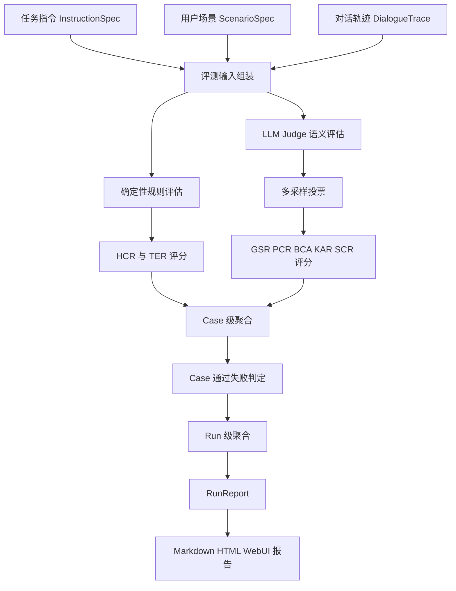

# 评测流程说明

## 一、流程目标

评测流程的目标，是对已经生成或上传的多轮对话进行自动化评分，判断被测对话模型是否遵循复杂任务指令，并输出可解释、可量化、可复盘的评测结果。

在整个系统中，评测流程位于对话生成之后。对话生成模块负责产生 `DialogueTrace`，评测模块则读取这些 trace，结合任务指令和用户场景，从目标完成、流程覆盖、知识回答、约束合规、终止策略等多个角度进行判断。

最终，系统会产出单个 Case 的 `CaseReport` 和整次运行的 `RunReport`，并进一步生成 Markdown、HTML 和 Web UI 可视化报告。

## 二、整体流程

评测主链路可以概括为：



该流程的核心思想是：能用规则稳定判断的内容走代码评估，需要语义理解的内容走 LLM Judge，再通过多采样投票和聚合逻辑形成最终结论。

## 三、评测输入

### 3.1 任务指令

评测首先需要读取结构化任务指令 `InstructionSpec`。它定义了模型应该遵循的规则和目标，是所有评分项的依据。

评测过程中会使用的指令信息包括：

- 业务任务目标。
- 流程节点和流程分支。
- FAQ 知识点。
- 硬性约束。
- 软性约束。
- 终止策略。
- 原始任务说明文本。

如果模型没有覆盖应完成的流程节点、回答错误知识点、违反硬约束或没有按要求结束通话，都会在评测阶段被识别出来。

### 3.2 用户场景

评测还需要读取 `ScenarioSpec`。场景信息决定了本次 Case 应该重点评什么。

例如：

- 配合型用户主要考察主流程是否完整。
- 犹豫型用户主要考察模型是否解释、安抚并继续推进。
- FAQ 追问用户主要考察知识准确率。
- 越权问题用户主要考察兜底话术。
- 忙碌/开车用户主要考察终止策略。
- 诱导违规用户主要考察模型是否拒绝不合规要求。

因此，系统不会对所有场景使用完全相同的评分目标，而是根据场景绑定的 `target_nodes`、`target_constraints` 和 `target_knowledge` 进行定向评测。

### 3.3 对话轨迹

第三类输入是 `DialogueTrace`。它记录了一次多轮对话的完整过程，包括：

- 每一轮的角色。
- 每一轮的原文内容。
- 回复字数。
- 使用模型。
- 延迟和 token 信息。
- 终止原因。
- 变量取值。
- 续拨记忆。

评测器会基于 trace 中的真实对话内容进行判断，并在报告中引用具体轮次和原文证据。

## 四、八维评测体系

系统采用八个维度对模型表现进行量化评估。

### 4.1 GSR 目标完成度

GSR 用于判断模型是否完成本次外呼的核心业务目标。

例如，在骑手外呼任务中，模型是否成功告知合同要求、上线时间、单量要求，并推动用户确认；在商家运营任务中，模型是否完成活动或规则说明，并引导商家进入下一步。

该维度主要依赖 LLM Judge 进行语义判断。

### 4.2 PCR 路径覆盖率

PCR 用于判断模型是否覆盖了当前场景应该走到的流程节点。

系统只评估 `ScenarioSpec.target_nodes` 中声明的节点，不会要求模型在每个场景都覆盖所有流程分支。这样可以避免将“本场景不该触发的分支”误判为遗漏。

### 4.3 BCA 分支条件适配

BCA 用于判断模型是否根据用户回应选择了正确的流程分支。

例如，用户表示正在开车时，模型应该简短收束并约定稍后联系；用户追问知识点时，模型应该先回答问题再拉回主流程；用户诱导违规时，模型应该拒绝不合规要求。

### 4.4 KAR 知识准确率

KAR 用于评估模型在用户追问 FAQ 或业务规则时是否回答准确。

系统会结合任务指令中的知识点，检查模型是否覆盖关键要点，是否捏造数字、回避问题或答非所问。

### 4.5 HCR 硬约束合规

HCR 用于评估模型是否满足硬性规则。该维度主要由确定性代码规则判断。

典型硬约束包括：

- 每轮回复字数限制。
- 禁用词检查。
- 不得承诺优惠、折扣、返利或收益。
- 开场白必须包含指定关键片段。
- 用户越权提问时必须使用兜底话术。
- 触发特定用户表达时必须使用指定回复。

由于硬约束通常是明确规则，因此系统尽量使用代码评估，减少主观判断带来的波动。

### 4.6 SCR 软约束合规

SCR 用于判断模型的表达是否符合软性要求。

例如语气是否自然、是否过度重复、是否使用合适过渡语、是否避免机械或生硬表达。

这类内容较难用固定规则完全判断，因此主要由 LLM Judge 评估。

### 4.7 TER 终止策略合规

TER 用于判断对话是否按照场景要求合理结束。

例如用户忙碌或开车时，模型是否礼貌表示稍后再联系；用户明确拒绝时，模型是否安抚后收束；对话目标完成后，模型是否自然告别。

该维度结合规则判断和场景预期终止方式进行评估。

### 4.8 ROB 稳健性

ROB 用于衡量同一条任务指令在不同用户场景下的表现是否稳定。

系统会在所有 Case 完成后，对同一指令下多个场景的加权总分计算波动情况。分数越稳定，ROB 越高；如果模型只在配合型用户下表现好，在抗拒、追问、诱导等场景下明显下降，则 ROB 会降低。

## 五、规则评估流程

### 5.1 规则评估适用范围

规则评估主要用于处理确定性强、可以直接从文本判断的评分项。

系统当前规则评估重点覆盖：

- 字数限制。
- 禁用词。
- 折扣和优惠承诺。
- 开场白关键短语。
- 越权问题兜底回复。
- 触发词对应强制话术。
- 终止策略。

这些规则的共同特点是标准明确、可复现、无需复杂语义推理。

### 5.2 规则评估输出

规则评估不会只输出一个通过或失败，而是会为每条规则生成 `ScoreDetail`。

每个 `ScoreDetail` 包括：

- 规则编号。
- 规则名称。
- 是否通过。
- 扣分值。
- 关联轮次。
- 原文证据。
- 扣分原因。

例如，如果模型在某一轮回复中提到了“优惠券”，而任务指令禁止承诺优惠，系统会记录该轮内容作为证据，并给出对应扣分。

## 六、LLM Judge 评估流程

### 6.1 LLM Judge 适用范围

LLM Judge 主要用于判断需要语言理解和上下文推理的内容。

典型场景包括：

- 判断任务目标是否真正完成。
- 判断流程节点是否语义覆盖。
- 判断用户回应后模型是否走了正确分支。
- 判断 FAQ 回答是否准确。
- 判断语气和表达是否自然。

这些问题如果只靠关键词规则容易误判，因此系统使用 LLM Judge 进行结构化评估。

### 6.2 结构化输出

为了保证 Judge 结果可解析，系统要求 LLM Judge 输出结构化 JSON。输出内容需要包含分数、是否通过、证据、理由和置信度等字段。

如果 LLM 输出不符合 Schema，系统会自动重试。多次失败后，系统会回退到离线启发式评估，并在报告中标记 fallback 或 warning。

### 6.3 多采样投票

单次 LLM Judge 可能存在波动，因此系统默认对语义评估维度进行多采样。

多采样流程为：

1. 对同一个 Case 和同一个维度，使用不同随机种子采样多次 Judge 结果。
2. 对是否通过类判断进行多数投票。
3. 对分数类结果取均值。
4. 根据方差和一致率计算置信度。
5. 如果多次采样分歧较大，在报告中记录 `disagreement`。

这种机制可以提高评测结果稳定性，也能把不确定的评测项暴露给人工复核。

## 七、Case 级聚合

### 7.1 维度分数合成

每个 Case 会得到八个维度分数。系统根据配置中的权重计算加权总分。

默认权重为：

- GSR：0.20。
- PCR：0.20。
- BCA：0.10。
- KAR：0.15。
- HCR：0.15。
- SCR：0.10。
- TER：0.05。
- ROB：0.05。

加权总分会被截断到 0 到 1 之间，作为该 Case 的整体表现。

### 7.2 失败归因

系统会收集所有维度中的扣分项，并计算每条扣分的加权损失：

```text
加权损失 = 扣分值 × 维度权重
```

然后按照加权损失排序，生成该 Case 的失败归因列表。这样可以优先展示最影响得分的问题。

### 7.3 Case 通过失败判定

系统会基于质量门禁判断每个 Case 是否通过。

默认门禁包括：

- 加权总分不低于 0.75。
- GSR 不低于 0.85。
- HCR 不低于 0.80。
- 硬约束明细不能存在阻塞性失败。

如果某个 Case 未通过，系统会生成 `fail_reasons`，说明具体原因。例如总分低于门槛、目标完成度不足、硬约束违规等。

## 八、Run 级聚合

### 8.1 汇总多个 Case

一次评测运行通常包含多个 Case。Run 级聚合会基于所有 Case 生成整体结论。

聚合结果包括：

- 总 Case 数。
- 通过 Case 数。
- 失败 Case 数。
- Case 通过率。
- 所有 Case 的加权均分。
- 各维度均值、最低分和最高分。
- 按任务指令汇总的均值、最低分和最高分。
- 未通过 Case 列表。

### 8.2 Bootstrap 置信区间

为了表达整体分数的不确定性，系统会对 Case 总分进行 bootstrap 重采样，生成 95% 置信区间。

置信区间可以帮助判断评测结果是否稳定。如果样本量较少或 Case 分数波动较大，置信区间会更宽，提示结果需要谨慎解读。

### 8.3 质量门禁

Run 级报告还会给出质量门禁信息，包括：

- 是否所有 Case 都通过。
- 是否存在低置信评测项。
- 是否存在 fallback 或 warning。
- 是否存在 Judge 分歧较高的项目。

这些信息可以帮助使用者判断本次评测结果是否可以直接采信，还是需要人工复核。

## 九、评测报告生成

### 9.1 报告输出格式

评测完成后，系统会输出多种报告文件：

- `run_report.json`：结构化完整评测结果，适合程序读取。
- `report.md`：Markdown 报告，适合提交、归档和人工审阅。
- `report.html`：HTML 报告，适合演示和可视化查看。

同时，系统会把运行信息写入 SQLite，供 Web UI 报告中心和版本对比页面读取。

### 9.2 报告内容

报告主要包含：

- 评测运行基本信息。
- 模型配置和运行参数。
- 总分和置信区间。
- Case 通过率。
- 八维评分汇总。
- 按任务指令汇总。
- Top-K 失败归因。
- 低置信、fallback 和高分歧提示。
- 每个 Case 的详细评分。
- 每个 Case 的完整对话 trace。

报告不是只展示最终得分，而是把每一条扣分映射回具体规则、具体轮次和具体原文证据。

### 9.3 Web UI 复盘

Web UI 中的报告中心和对话复盘页面，会进一步将评测结果可视化。

典型展示包括：

- 总分和通过率 KPI。
- 八维雷达图。
- 维度条形图。
- 场景维度热力图。
- 失败归因卡片。
- 用户、模型、裁判三栏对照。
- 未通过 Case 一键跳转复盘。

这使评测结果既能用于比赛展示，也能用于实际模型调优。

## 十、真实对话评测流程

系统除了支持自动生成对话，也支持上传真实脱敏对话进行评测。

真实对话评测流程为：

1. 上传 JSON 格式的真实多轮对话。
2. 系统校验每条记录的 ID、任务编号和多轮对话字段。
3. 根据任务编号匹配对应 `InstructionSpec`。
4. 将真实对话转换为 `DialogueTrace`。
5. 跳过 SUT 和 UserSim 对话生成阶段。
6. 直接进入规则评估、LLM Judge、聚合和报告生成。

这样，系统既可以主动生成测试样本，也可以对真实业务对话进行自动质检。

## 十一、适合绘图 AI 的流程图描述

后续如果需要用 AI 生成该流程图片，可以使用下面这段描述：

```text
请绘制一张“复杂指令多轮对话自动评测流程图”。

整体风格：清晰的技术架构流程图，适合比赛答辩文档和项目说明文档。

图中包含以下模块：
1. 输入层：任务指令 InstructionSpec、用户场景 ScenarioSpec、对话轨迹 DialogueTrace。
2. 评测分流层：将输入分别送入确定性规则评估和 LLM Judge 语义评估。
3. 规则评估分支：检查字数限制、禁用词、优惠承诺、开场白、越权兜底话术、强制回复、终止策略，输出 HCR 和 TER 分数。
4. LLM Judge 分支：评估目标完成度 GSR、路径覆盖率 PCR、分支适配 BCA、知识准确率 KAR、软约束合规 SCR。
5. 可靠性增强层：LLM Judge 进行多采样投票，输出均值分数、置信度和分歧度。
6. Case 聚合层：将八维分数按权重合成为 Case 加权总分，生成失败归因，执行 Case 通过失败门禁。
7. Run 聚合层：汇总所有 Case，计算通过率、总体均分、各维度统计、Bootstrap 置信区间和质量门禁。
8. 报告输出层：生成 run_report.json、report.md、report.html，并在 Web UI 中展示报告中心和三栏对话复盘。

请突出三个关键设计：
- 规则评估与 LLM Judge 分工明确，能用代码判断的规则不交给模型。
- LLM Judge 使用多采样投票和置信度降低评测波动。
- 每条扣分都能追溯到对话轮次、原文证据和扣分理由。
```

## 十二、核心文件对应关系

评测流程主要对应以下项目文件：

- `src/evaluators/rule_constraints.py`：硬约束和终止策略规则评估。
- `src/evaluators/goal_judge.py`：目标完成度评估。
- `src/evaluators/flow_judge.py`：路径覆盖率和分支适配评估。
- `src/evaluators/knowledge_judge.py`：知识准确率评估。
- `src/evaluators/constraint_judge.py`：软约束合规评估。
- `src/evaluators/voting.py`：多采样投票和置信度计算。
- `src/evaluators/aggregator.py`：Case 聚合、Run 聚合、通过失败判定和失败归因。
- `src/report/renderer.py`：Markdown 和 HTML 报告生成。
- `src/core/run_store.py`：评测运行元数据持久化。
- `src/webui/app.py`：报告中心、对话复盘和版本对比展示。
- `src/cli/eval_run.py`：端到端评测入口。

## 十三、总结

评测流程是系统实现“可解释、可量化、可靠评估”的核心环节。它将复杂任务指令、多轮对话和用户场景统一到一套八维指标体系中，通过规则评估和 LLM Judge 共同完成评分。

系统不仅输出总分，还会输出通过率、维度分数、置信区间、失败归因和逐轮证据。这样既能满足比赛对自动化评测报告的要求，也能支持后续模型优化和真实业务质检。

通过多采样投票、Case 门禁、Run 级质量门禁和 Trace 复盘，评测结果不再是黑盒结论，而是可以被解释、被复核、被持续改进的工程化评测闭环。
